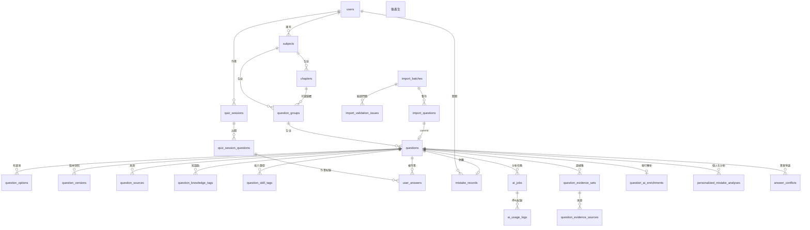

# 資料模型（ERD）

> 版本：0.1.0（Phase 0 設計；實際 Drizzle schema 與 migration 於 Phase 1 起依此文件實作）

---

## 0. 設計原則

### 0.1 JSONB 的使用界線

規格 §15 明令「請避免將所有資料都塞進 JSONB」。本專案的規則：

**允許用 JSONB**：AI 原始輸出（`raw_output`）、歷史快照（`question_versions.snapshot`、`stats_snapshot`）、結構不固定的暫存區（`import_questions.options`）、非查詢用的結構化明細（`option_analysis`）。

**禁止用 JSONB**：任何需要篩選、排序、聚合或建立外鍵的欄位。例如正確答案不存成 JSON 陣列，而是 `question_options.is_correct` 布林欄位；知識點不存成字串陣列，而是 `question_knowledge_tags` 關聯表。

### 0.2 軟刪除

`subjects`、`chapters`、`question_groups`、`questions` 使用 `deleted_at`。原因：歷史作答紀錄永遠指向題目，硬刪會破壞可追蹤性（規格 §20.19）。
唯一索引一律加 `WHERE deleted_at IS NULL` 的部分索引條件。

### 0.3 列舉策略

- **真正封閉的集合**用 PostgreSQL `pgEnum`：`question_type`、`reveal_mode`、`tag_role`。
- **可能演進的集合**用查表：`error_types`、`skill_tags` 本身就是資料表，可新增而不需 migration。
- **狀態欄位**用 `text` + `CHECK` 約束：新增狀態值只需改 CHECK，不必處理 `ALTER TYPE ... ADD VALUE` 無法在交易內執行的問題。

### 0.4 共通欄位

所有表都有 `id uuid PRIMARY KEY DEFAULT gen_random_uuid()`、`created_at timestamptz NOT NULL DEFAULT now()`；可變更的表另有 `updated_at timestamptz`。

單一使用者仍保留 `user_id`，因為錯題與作答本質上屬於使用者；日後要支援多人不必重構。

---

## 1. 全域關聯總覽



---

## 2. 身分與系統設定

### `users`
| 欄位 | 型別 | 說明 |
|---|---|---|
| `id` | uuid PK | |
| `username` | text UNIQUE NOT NULL | 登入帳號 |
| `display_name` | text | |
| `password_hash` | text NOT NULL | argon2id；**明文永不儲存** |
| `last_login_at` | timestamptz | |

### `refresh_tokens`
規格未列出，但 refresh token 輪替必須有伺服器端狀態才能撤銷，屬必要補充。

| 欄位 | 型別 | 說明 |
|---|---|---|
| `id` | uuid PK | |
| `user_id` | uuid FK → users | |
| `token_hash` | text NOT NULL UNIQUE | **只存雜湊**，外洩資料庫也無法還原 token |
| `expires_at` | timestamptz NOT NULL | |
| `revoked_at` | timestamptz | 輪替時將舊 token 標記撤銷 |
| `replaced_by_id` | uuid FK → refresh_tokens | 追蹤輪替鏈，可偵測重放 |
| `user_agent`, `ip` | text | |

### `app_settings`
| 欄位 | 型別 | 說明 |
|---|---|---|
| `key` | text PK | 例如 `setup.completed`、`quiz.defaults` |
| `value` | jsonb NOT NULL | 結構因 key 而異，屬合理的 JSONB 用途 |

> `setup.completed = true` 是初始化頁面永久停用的依據（FR-AUTH-02）。

---

## 3. 題庫階層

### `subjects`
`id`、`user_id`、`name`、`code`、`description`、`sort_order int`、`deleted_at`
唯一：`(user_id, name) WHERE deleted_at IS NULL`

### `chapters`
`id`、`subject_id FK`、`name`、`description`、`sort_order int`、`deleted_at`
唯一：`(subject_id, name) WHERE deleted_at IS NULL`
**額外唯一：`(subject_id, id)`** — 供下方複合外鍵使用。

### `question_groups`
| 欄位 | 型別 | 說明 |
|---|---|---|
| `id` | uuid PK | |
| `subject_id` | uuid FK → subjects **NOT NULL** | |
| `chapter_id` | uuid **NULL** | 允許為空，題組可直接掛在科目下（FR-CAT-03） |
| `name`, `description`, `source`, `year`, `notes` | | 規格 §4 要求的欄位 |
| `sort_order` | int | |
| `deleted_at` | timestamptz | |

**關鍵約束**：
```sql
FOREIGN KEY (subject_id, chapter_id)
  REFERENCES chapters (subject_id, id)
```
由資料庫保證「題組的章節必屬同一科目」（FR-CAT-05）。PostgreSQL 的 `MATCH SIMPLE`（預設）在 `chapter_id IS NULL` 時不檢查外鍵，正好允許章節為空。這比應用層檢查可靠——任何寫入路徑都繞不過。

### `questions`
| 欄位 | 型別 | 說明 |
|---|---|---|
| `id` | uuid PK | |
| `user_id` | uuid FK | |
| `question_group_id` | uuid FK → question_groups NOT NULL | |
| `subject_id`, `chapter_id` | uuid | 反正規化，供列表篩選；以複合外鍵與觸發器維持一致 |
| `external_id` | text | 來自匯入檔，可為 null |
| `question_number` | int | 題號 |
| `type` | `question_type` enum | `single_choice` / `multiple_choice` |
| `stem` | text NOT NULL | 題幹，不可為空 |
| `explanation` | text NULL | **允許為空，系統絕不自動編造**（FR-Q-08） |
| `source_page` | int | |
| `source_reference` | text | |
| `review_required` | boolean NOT NULL DEFAULT false | |
| `review_reason` | text | |
| `status` | text CHECK | `active` / `disputed` / `excluded` |
| `current_version` | int NOT NULL DEFAULT 1 | |
| `content_hash` | text NOT NULL | sha256(正規化 stem + options + correctAnswers) |
| `deleted_at` | timestamptz | |

唯一：`(question_group_id, question_number) WHERE deleted_at IS NULL`
唯一：`(user_id, external_id) WHERE external_id IS NOT NULL AND deleted_at IS NULL`
索引：`(subject_id, status)`、`(chapter_id)`、`(content_hash)`、GIN 全文索引於 `stem`

> **`content_hash` 是 AI 快取失效的唯一判準**（規格 §12）。題幹、選項或正確答案任一變動都會改變雜湊，既有解析自動失效。

### `question_options`
| 欄位 | 型別 | 說明 |
|---|---|---|
| `id` | uuid PK | |
| `question_id` | uuid FK ON DELETE CASCADE | |
| `key` | varchar(4) NOT NULL | 大寫代號 A/B/C/D… |
| `text` | text NOT NULL | |
| `is_correct` | boolean NOT NULL DEFAULT false | **正確答案以此表達，不用 JSON 陣列** |
| `sort_order` | int NOT NULL | 原始順序 |

唯一：`(question_id, key)`

單選恰 1 個、複選至少 2 個正確選項的規則由 service 與匯入驗證把關，並有單元測試覆蓋（跨列條件不適合寫成 DB 約束，硬寫會用到成本高的觸發器）。

### `question_versions`
`id`、`question_id FK`、`version int`、`snapshot jsonb`、`content_hash`、`changed_fields text[]`、`change_reason`、`created_by`
唯一：`(question_id, version)`

`snapshot` 存完整題目與選項——這是 JSONB 的正當用途（歷史快照，不需查詢內部欄位）。

### `question_sources`
`id`、`question_id FK`、`kind`（`pdf`/`url`/`book`/`other`）、`label`、`page_from`、`page_to`、`url`、`reference_text`

---

## 4. 匯入暫存區

**核心原則：未驗證資料絕不進入 `questions`**（FR-IMP-03）。

### `import_batches`
| 欄位 | 說明 |
|---|---|
| `id`、`user_id` | |
| `filename`、`file_size`、`file_hash` | |
| `schema_version` | 檔案宣告的版本 |
| `status` | `uploaded`／`validating`／`validated`／`partially_valid`／`failed`／`committing`／`committed`／`discarded` |
| `target_subject_id`、`target_chapter_id`、`target_group_id` | 匯入目標（可由檔案內容建立） |
| `total_count`、`valid_count`、`error_count`、`warning_count`、`review_required_count`、`committed_count` | 統計 |
| `raw_payload` | jsonb，原始上傳內容，供追溯（FR-IMP-09） |
| `validated_at`、`committed_at` | |

### `import_questions`
暫存區。因為資料尚未驗證，結構可能不合法，故 `options`、`correct_answers` 以 jsonb 儲存——這正是 JSONB 的正當用途。

`id`、`batch_id FK`、`row_index`、`external_id`、`question_number`、`type`、`stem`、`options jsonb`、`correct_answers jsonb`、`explanation`、`source_page`、`source_reference`、`review_required`、`review_reason`、`status`（`pending`/`valid`/`warning`/`error`/`excluded`/`fixed`/`committed`）、`edited_payload jsonb`、`resulting_question_id FK NULL`

### `import_validation_issues`
`id`、`batch_id FK`、`import_question_id FK NULL`、`level`（`error`/`warning`）、`code`、`field_path`、`message`、`details jsonb`

錯誤碼完整清單見 [API_CONTRACT.md](./API_CONTRACT.md#5-匯入驗證規則與錯誤碼)。

---

## 5. 受控標籤系統

規格 §8 的核心訴求：**標籤不得由 AI 自由生成**，避免同義詞失控。

### `knowledge_tags`（知識點）
`id`、`user_id`、`subject_id NULL`（可限定科目範圍）、`name`、`slug`、`description`、`parent_id NULL`（可建階層）、`status`（`active`/`deprecated`/`merged`）、`merged_into_id FK NULL`
唯一：`(user_id, subject_id, slug) WHERE status <> 'merged' AND subject_id IS NOT NULL`
以及 `(user_id, slug) WHERE status <> 'merged' AND subject_id IS NULL`

> 分成兩個部分唯一索引，是因為 PostgreSQL 的唯一索引不會把兩個 NULL 視為相等 ——
> 若只用 `(user_id, subject_id, slug)`，跨科目通用的標籤（`subject_id IS NULL`）就完全不受唯一性約束。

`parent_id` 與 `merged_into_id` 都是自我參照外鍵（drizzle 需要 `AnyPgColumn` 標註才會產生約束）。
`merged_into_id` 為 `ON DELETE restrict`：合併目標不可被直接刪除，否則已合併的標籤會指向不存在的列。
另有 CHECK 保證「`status = 'merged'` ⇔ `merged_into_id IS NOT NULL`」。

**`usage_count` 不存成欄位**，改為查詢時即時計算。合併、刪除、改標籤都會影響它，
任何一條寫入路徑忘了維護就會靜默失準；與錯題紀錄採同一原則（可推導的數字不另存一份）。

### `skill_tags`（能力類型）
`id`、`name`、`slug`、`description`、`sort_order`、`status`
種子資料：概念辨識、條件判斷、規則適用、案例推理、例外規則辨識、資料判讀

### `error_types`（錯誤類型）
`id`、`code`、`name`、`description`、`sort_order`、`status`、`is_fallback boolean`
種子資料：概念混淆、忽略題目條件、例外規則遺漏、規則適用錯誤、選項比較錯誤、記憶錯誤、推理中斷、**無法判定（`is_fallback = true`）**

> 保留 fallback 值很重要：AI 判斷不出錯因時必須有合法選項可用，否則會被迫亂猜一個具體錯誤類型。

### `question_knowledge_tags`
`question_id`、`knowledge_tag_id`、`role`（`primary`/`secondary`）、`source`（`manual`/`ai`/`import`）、`confidence numeric`
PK：`(question_id, knowledge_tag_id)`
**唯一索引：`(question_id) WHERE role = 'primary'`** — 資料庫層保證主要知識點最多 1 個。
次要最多 2 個由 service 檢查（跨列計數約束不適合寫進 DB）。

### `question_skill_tags`
同結構，`(question_id) WHERE role = 'primary'` 部分唯一索引保證每題最多 1 個主要能力類型。

### `tag_aliases`
`id`、`tag_kind`（`knowledge`/`skill`/`error_type`）、`alias`、`normalized_alias`、`canonical_tag_id`
唯一：`(tag_kind, normalized_alias)`

`normalized_alias` = 去空白、轉小寫、全形轉半形後的字串。AI 回傳的標籤名稱先經此表正規化，對不上才視為新標籤建議。

正規化的實作是 `@repo/contracts` 的 `normalizeTagName()`，順序固定為
**NFKC（全形轉半形）→ 轉小寫 → 去掉所有空白**。NFKC 必須在轉小寫之前，否則「Ａ」不會先變成「A」。

`canonical_tag_id` 沒有外鍵：它依 `tag_kind` 指向三張不同的表，無法用單一外鍵表達，
由 service 在建立與合併時驗證。`tag_suggestions.resolved_tag_id` 同理。

### `tag_suggestions`
`id`、`tag_kind`、`suggested_name`、`normalized_name`、`context_question_id`、`source`（`ai`/`user`）、`ai_job_id`、`rationale`、`occurrence_count`、`status`（`pending`/`approved`/`merged`/`rejected`）、`resolved_tag_id`、`reviewed_at`、`review_note`

`occurrence_count` 讓重複出現的建議自然浮上來，優先審核。
待審中的同名建議以部分唯一索引 `(user_id, tag_kind, normalized_name) WHERE status = 'pending'` 收斂成一列，
重複提交只累加次數。另有 CHECK 保證「`status = 'pending'` ⇔ `reviewed_at IS NULL`」，讓審核紀錄不會殘缺。

**這是新標籤進入系統的唯一通道。** AI 找不到合適的既有標籤時只能寫進這裡，
沒有任何端點可以由名稱直接建立正式標籤（FR-TAG-06、§22 之 12）。

---

## 6. 作答系統

### `quiz_sessions`
| 欄位 | 說明 |
|---|---|
| `id`、`user_id` | |
| `mode` | `practice`／`mistake_review`／`knowledge_focus`／`exam` |
| `order_strategy` | `sequential`／`random` |
| `shuffle_options` | boolean |
| `question_limit` | int NULL |
| `reveal_mode` | `reveal_mode` enum：`immediate`／`after_submit` |
| `allow_answer_change` | boolean |
| `status` | `in_progress`／`submitted`／`abandoned` |
| `seed` | int，讓隨機順序可重現 |
| `total_questions`、`answered_count`、`correct_count`、`score numeric` | |
| `started_at`、`submitted_at`、`duration_ms` | |
| `config_snapshot` | jsonb，建立當下的完整設定 |

### `quiz_session_scopes`
把出題範圍正規化，而非塞進 jsonb，才能查詢「哪些場次練過這個題組」。
`session_id`、`scope_type`（`subject`/`chapter`/`question_group`/`knowledge_tag`/`mistake`）、`ref_id`

### `quiz_session_questions`
| 欄位 | 說明 |
|---|---|
| `id`、`session_id FK`、`question_id FK` | |
| `position` | int，出題順序 |
| `option_order` | **text[]**，打亂後的選項 key 序列，例如 `{C,A,D,B}` |
| `question_version` | int，出題當下的題目版本 |
| `correct_answers_snapshot` | text[]，出題當下的正確答案 |
| `status` | `unanswered`／`answered`／`skipped` |

唯一：`(session_id, position)`、`(session_id, question_id)`

> **`option_order` 是選項隨機化的核心。** 前端只拿到這個顯示順序；使用者送回的是真實 key；判分比對 `correct_answers_snapshot`。顯示與判分因此完全解耦，可用純函式單元測試（規格 §18 要求的「選項順序隨機後的答案映射」）。

### `user_answers`
| 欄位 | 說明 |
|---|---|
| `id`、`session_id`、`session_question_id`、`question_id`、`user_id` | |
| `selected_answers` | text[] |
| `correct_answers_snapshot` | text[]，**再存一份**：題目日後修改也不影響歷史（FR-QUIZ-13） |
| `is_correct` | boolean |
| `is_provisional` | boolean，爭議題期間為 true，統計一律排除（FR-QUIZ-14） |
| `response_time_ms` | int |
| `attempt_number` | int |
| `answer_changed_count` | int |
| `reveal_mode` | 作答當下的模式 |
| `question_version` | int |
| `answered_at` | timestamptz |

唯一：`(session_question_id, attempt_number)`
索引：`(user_id, question_id, answered_at DESC)`、`(user_id, is_correct) WHERE is_provisional = false`

### `mistake_records`
| 欄位 | 說明 |
|---|---|
| `id`、`user_id`、`question_id` | |
| `mistake_count` | int，累計答錯次數 |
| `consecutive_correct` | int，連續答對次數 |
| `total_attempts` | int，該題的作答筆數（直接數 `user_answers`） |
| `recent_accuracy` | numeric，近 10 次正確率 |
| `mastery_state` | `active`／`improving`／`mastered` |
| `first_missed_at`、`last_missed_at`、`last_answered_at` | |
| `last_error_type_id` | FK → error_types（**Phase 3**，見下方說明） |
| `is_resolved` | boolean，是否曾經重新答對過；一旦為 true 不再變回 false |

唯一：`(user_id, question_id)`

CHECK `mastery_state` 必須與 `consecutive_correct` 一致（0 → active、1～2 → improving、≥3 → mastered），
由資料庫直接鎖住 `computeMasteryState()` 的規則，任何寫入路徑都繞不過去。

> **錯題紀錄是 `user_answers` 的衍生狀態**，不是獨立累加的計數器。
> 每次作答後由該題完整作答歷史重新摺疊算出（`MistakeRecordsService.recompute`）。
> 理由見 API_CONTRACT §7。

### `mistake_record_error_types`（Phase 3）
支援「依錯誤類型篩選錯題」（FR-MIS-02）。
`mistake_record_id`、`error_type_id`、`occurrence_count`、`source`

本表與 `mistake_records.last_error_type_id` 都需要外鍵指向 `error_types`，
而該表屬 Phase 3，因此**一併延後至 Phase 3 建立** ——
先建立沒有外鍵的孤兒欄位會違反本專案「參照完整性由資料庫保證」的原則。
Phase 2 因此實際新增 5 張表而非 6 張。

### 熟練狀態規則

純函式 `computeMasteryState(consecutiveCorrect)`（實作於 `@repo/contracts` 的 `quiz/mastery.ts`）：

| 條件 | 狀態 |
|---|---|
| `consecutive_correct === 0` | `active` |
| `consecutive_correct` 為 1 或 2 | `improving` |
| `consecutive_correct >= 3` | `mastered` |

答錯時：`mistake_count += 1`、`consecutive_correct = 0` → 狀態退回 `active`。
**答對一次不刪除紀錄**（FR-MIS-05）——紀錄永遠保留，只是狀態改變。

規則刻意簡單且可解釋，避免「為什麼這題算學會了」無法回答。

---

## 7. AI 相關

### `prompt_versions`
`id`、`operation`（`research_plan`/`evidence_synthesis`/`final_explanation`/`aggregate_analysis`）、`version`、`system_prompt`、`user_template`、`output_schema jsonb`、`model_defaults jsonb`、`is_active`
唯一：`(operation, version)`

Prompt 內容以檔案維護（進版控），啟動時 seed 進資料庫，讓分析結果能外鍵指向確切版本。

### `ai_jobs`
| 欄位 | 說明 |
|---|---|
| `id`、`user_id` | |
| `job_type` | `question_analysis`／`aggregate_analysis`／`maintenance` |
| `queue` | 佇列名稱 |
| `bullmq_job_id` | |
| `idempotency_key` | text **UNIQUE** |
| `question_id` | FK NULL |
| `target_ref` | jsonb，非單題任務的目標描述 |
| `status` | `pending`／`active`／`completed`／`failed`／`retrying`／`cancelled` |
| `progress_step` | `ANALYZING_QUESTION`／`SEARCHING_SOURCES`／`SYNTHESIZING_EVIDENCE`／`GENERATING_EXPLANATION`／`SAVING_RESULT`／`COMPLETED` |
| `progress_pct` | int |
| `priority` | int，1～4 |
| `attempts`、`max_attempts` | |
| `error_code`、`error_message` | |
| `started_at`、`finished_at`、`cancelled_at` | |

> `idempotency_key` 同時作為 BullMQ 的 `jobId`：**資料庫唯一約束與佇列去重雙重保證**同一任務不重複執行（規格 §14）。

### `ai_usage_logs`
規格 §二逐條要求的欄位全部落表：

`id`、`ai_job_id FK NULL`、`user_id`、`operation`、`model`、`prompt_version`、`request_status`（`success`/`schema_invalid`/`semantic_invalid`/`rate_limited`/`http_error`/`timeout`/`cancelled`）、`http_status`、`latency_ms`、`input_tokens`、`output_tokens`、`total_tokens`、`reasoning_effort`、`finish_reason`、`error_code`、`error_message`、`retry_count`、`attempt_index`、`created_at`

索引：`(created_at DESC)`、`(operation, request_status)`

> `input_tokens` / `output_tokens` 可為 null，但實測 NVIDIA 確實回傳 `usage`，正常情況會有值。
> `reasoning_effort` 一併記錄，日後可用實際數據回頭調整三階段設定。

### `question_evidence_sets`
`id`、`question_id FK`、`ai_job_id`、`research_mode`、`plan jsonb`（AI#1 原始輸出）、`queries jsonb`、`evidence_summary text`、`supported_claims jsonb`、`contradicted_claims jsonb`、`conflicts jsonb`、`insufficient_evidence boolean`、`recommended_answers text[]`、`confidence numeric`、`requires_human_review boolean`、`expires_at timestamptz`

### `question_evidence_sources`
| 欄位 | 說明 |
|---|---|
| `id`、`evidence_set_id FK` | |
| `source_id` | text，給 AI 看的合成 ID（`S1`、`S2`…） |
| `url`、`domain`、`title`、`published_date` | |
| `fetched_at` | |
| `content_snippet`、`content_length` | 截斷後的正文 |
| `search_provider`、`search_query`、`rank`、`score` | |
| `trust_tier` | `official`／`academic`／`educational`／`reference`／`other` |
| `is_used` | boolean，AI 是否實際引用 |

**唯一：`(evidence_set_id, source_id)`**

> 這個約束是「AI 引用只能指向實際存在來源」（驗收標準 #16）的資料庫基礎：儲存前程式驗證 `citations ⊆ 本集合的 source_id`，不符者剔除並將 `requires_human_review` 設為 true。AI 因此無法憑空產生 URL。

### `question_ai_enrichments`
題目層級的通用解析（與使用者答案無關，可跨次重用）。

`id`、`question_id FK`、`question_content_hash`、`evidence_set_id FK`、`prompt_version_plan`、`prompt_version_evidence`、`prompt_version_final`、`model`、`research_mode`、`canonical_explanation text`、`core_concept text`、`solution_steps jsonb`、`option_analysis jsonb`、`answer_validation jsonb`、`primary_knowledge_tag_id FK`、`confidence numeric`、`requires_human_review boolean`、`raw_output jsonb`、`generated_at`、`superseded_at`、`is_current boolean`

**唯一：`(question_id) WHERE is_current = true`** — 一題一份現行解析，舊版保留不刪。

### `personalized_mistake_analyses`
使用者層級的個人化錯因分析。

`id`、`user_id`、`question_id`、`user_answer_id`、`cache_key text UNIQUE`、`selected_answers text[]`、`correct_answers text[]`、`question_version`、`prompt_version`、`model`、`why_wrong text`、`missed_conditions jsonb`、`error_type_id FK`、`review_suggestions jsonb`、`citations jsonb`、`confidence`、`requires_human_review`、`raw_output jsonb`

`cache_key = sha256(questionId + questionVersion + selectedAnswers + correctAnswers + promptVersion + model)` — 完全依規格 §12 定義。同一題同一種錯法只分析一次。

### `aggregate_analyses`
`id`、`user_id`、`scope_type`、`scope_ref_ids jsonb`、`period_from`、`period_to`、`stats_snapshot jsonb`、`weakest_knowledge_tags jsonb`、`common_error_types jsonb`、`error_patterns jsonb`、`review_priority jsonb`、`recommended_groups jsonb`、`improvement jsonb`、`suggestions jsonb`、`representative_question_ids uuid[]`、`confidence`、`prompt_version`、`model`、`analysis_version int`、`raw_output jsonb`

`stats_snapshot` 保存分析當下的統計數據，讓結論可重現（FR-AGG-05）。

實作時額外加了三項（Phase 5，migration `0004`）：

| 增補 | 理由 |
|---|---|
| `ai_job_id`（FK → `ai_jobs`，`ON DELETE set null`） | ERD 原本沒列。少了它就無法追溯一份分析出自哪一次執行 |
| `stats_snapshot` 為 **NOT NULL** | 可為 null 等於允許存在一列無法回頭驗證的結論，而那正是 FR-AGG-05 要避免的 |
| CHECK `cardinality(representative_question_ids) <= 15` | 把純函式的上限鎖進資料庫，做法比照 `mistake_records` 的熟練狀態一致性約束。數字須與 `REPRESENTATIVE_QUESTION_LIMIT` 一致 |

`representative_question_ids` 是陣列，PostgreSQL 無法對它加外鍵。這可以接受：
題目只會被軟刪除，ID 不會變成懸空；已刪除的題目在畫面上單純不顯示。

### `answer_conflicts`
| 欄位 | 說明 |
|---|---|
| `id`、`question_id FK`、`evidence_set_id FK`、`ai_job_id` | |
| `stored_answers` | text[]，題庫原答案 |
| `verified_answers` | text[]，外部證據支持的答案 |
| `confidence` | numeric |
| `conflict_reason` | text |
| `evidence` | jsonb |
| `source_ids` | text[] |
| `requires_review` | boolean |
| `review_status` | `pending`／`kept_original`／`answer_updated`／`explanation_updated`／`marked_disputed`／`question_excluded` |
| `reviewed_at`、`review_note`、`resolved_by` | |

**唯一：`(question_id) WHERE review_status = 'pending'`** — 同一題不會累積重複的待審爭議。

爭議生效期間的連鎖效果：
1. `questions.status = 'disputed'`
2. 該題新的 `user_answers.is_provisional = true`
3. 所有能力統計查詢加上 `WHERE is_provisional = false`
4. 前端在題目上顯示爭議標示

→ 直接滿足驗收標準 #18「爭議題不會錯誤影響能力診斷」。

### `web_documents`
跨題重用的正文快取（規格未列，但「搜尋結果與擷取內容需要快取」且「永久資料不得只存 Redis」共同要求它存在）。

`id`、`url_hash text UNIQUE`、`url`、`domain`、`title`、`extracted_text text`、`content_length`、`http_status`、`fetched_at`、`expires_at`

---

## 8. 關鍵約束速查

| 約束 | 目的 | 對應需求 |
|---|---|---|
| `question_groups (subject_id, chapter_id) → chapters (subject_id, id)` | 章節必屬同科目，且允許為 NULL | FR-CAT-05 |
| `question_options (question_id, key)` 唯一 | 選項 key 不重複 | FR-Q-02 |
| `questions (question_group_id, question_number)` 部分唯一 | 題號不重複 | 匯入驗證 |
| `question_knowledge_tags (question_id) WHERE role='primary'` 唯一 | 主要知識點最多 1 個 | FR-TAG-02 |
| `question_skill_tags (question_id) WHERE role='primary'` 唯一 | 主要能力類型最多 1 個 | FR-TAG-03 |
| `question_evidence_sources (evidence_set_id, source_id)` 唯一 | 引用可驗證 | 驗收 #16 |
| `ai_jobs.idempotency_key` 唯一 | 任務不重複執行 | 規格 §14 |
| `personalized_mistake_analyses.cache_key` 唯一 | AI 結果重用 | 規格 §12 |
| `question_ai_enrichments (question_id) WHERE is_current` 唯一 | 一題一份現行解析 | 規格 §12 |
| `answer_conflicts (question_id) WHERE review_status='pending'` 唯一 | 不累積重複爭議 | FR-CONF-01 |
| `quiz_session_questions (session_id, position)` 唯一 | 出題順序明確 | FR-QUIZ-02 |
| `refresh_tokens.token_hash` 唯一 | token 可撤銷、可偵測重放 | FR-AUTH-05 |

---

## 9. AI 快取失效規則

`question_ai_enrichments` 在下列任一條件成立時才需重新研究（規格 §12）：

| 條件 | 偵測方式 |
|---|---|
| 題目內容變更 | `questions.content_hash ≠ enrichment.question_content_hash` |
| 選項變更 | 同上（雜湊已含選項） |
| 正確答案變更 | 同上（雜湊已含正確答案） |
| Prompt 版本變更 | `prompt_version_*` 比對目前啟用版本 |
| 模型版本變更 | `model` 比對 `NVIDIA_MODEL` |
| 搜尋資料過期 | `question_evidence_sets.expires_at < now()` |
| 使用者手動要求 | API 帶 `force=true` |

以上皆不成立時直接回傳既有結果，**不呼叫模型**。這是控制免費額度消耗最有效的手段。
